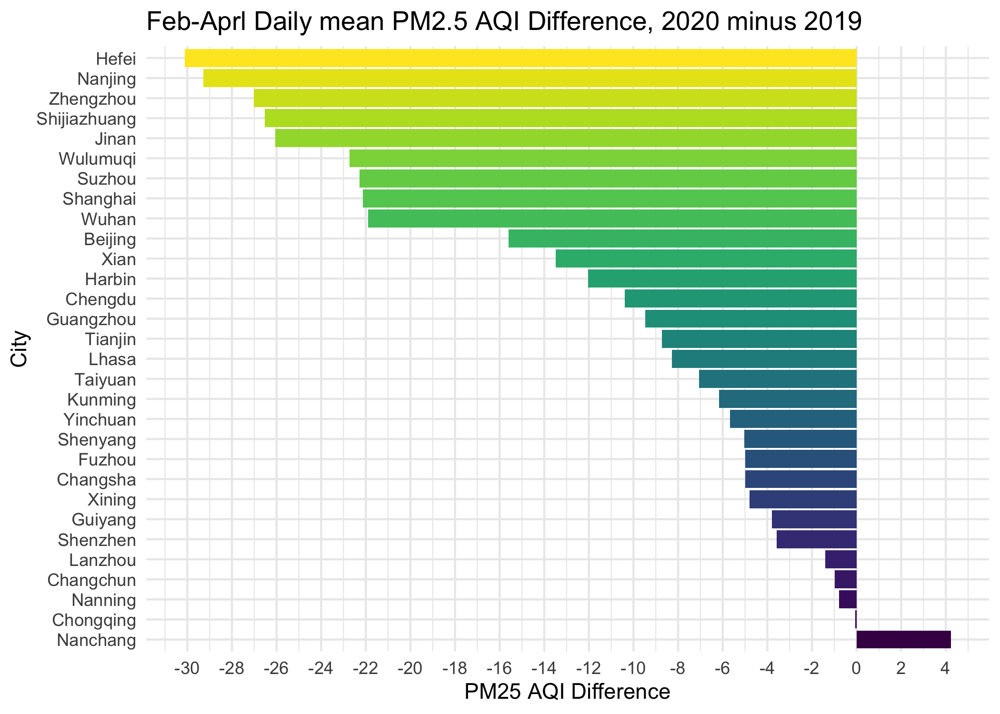

initial\_analysis
================
Weiheng Zhang
2021/11/17

``` r
library(tidyverse)
library(lubridate)
library(dplyr)
library(p8105.datasets)

theme_set(theme_minimal() + theme(legend.position = "bottom"))

options(
  ggplot2.continuous.colour = "viridis",
  ggplot2.continuous.fill = "viridis"
)

scale_colour_discrete = scale_color_viridis_d
scale_fill_discrete = scale_fill_viridis_d
```

``` r
city_files = list.files("data")[-1]
city_files = city_files[-19] #remove "project_timeline.xlsx"
```

Time period we are interested in

``` r
period_19 = interval(ymd("2019-02-01"), ymd("2019-04-30"))
period_20 = interval(ymd("2020-02-01"), ymd("2020-04-30"))
```

The daily mean PM2.5 AQI from Feb to Aprl of year 2019 and year 2020 in
each city.

``` r
city_period_meanPM25 = 
  tibble(city = character(),
         mean_19 = numeric(),
         mean_20 = numeric(),
         mean_diff = numeric())
```

``` r
for (city_file in city_files) {
  #print(city_file)
  
  path = str_c("data/", city_file)
  city = strsplit(city_file, split = '-')[[1]][1]
  
  cityAir = read_csv(path) %>% 
    mutate(date = as.Date(date, "%Y/%m/%d")) %>%
    arrange(date)
  
  cityAir_19 = cityAir %>% 
    filter(date %within% period_19) 
  
  cityAir_20 = cityAir %>% 
    filter(date %within% period_20)
  
  mean_19 = mean(cityAir_19$pm25, na.rm = T)
  mean_20 = mean(cityAir_20$pm25, na.rm = T)
  mean_diff = mean_20 - mean_19
  
  city_period_meanPM25 = 
    city_period_meanPM25 %>% 
    add_row(city = city, 
            mean_19 = mean_19, 
            mean_20 = mean_20, 
            mean_diff = mean_diff)
}
```

``` r
city_period_meanPM25 = 
  city_period_meanPM25 %>% 
  mutate(
    city = fct_reorder(city, mean_diff, .desc = T))
```

``` r
city_period_meanPM25 %>% 
  arrange(mean_diff) %>% 
  ggplot() +
  geom_bar(
    aes(x = mean_diff, y = city, fill = city), 
  stat = "identity") +
  scale_x_continuous(breaks = scales::pretty_breaks(n = 20)) +
  theme(legend.position = "none") +
  labs(
    title = "Feb-Aprl Daily mean PM2.5 AQI Difference, 2020 minus 2019",
    x = "PM25 AQI Difference",
    y = "City")
```

<!-- -->

Now we will see how the distribution of daily PM25 AQI differ between
time period 2019 Feb-Aprl and 2020 Feb-Aprl.

``` r
city_PM25_Distribution = 
  tibble(city = character(),
         period = character(),
         PM25 = numeric())
```

``` r
for (city_file in city_files) {

  path = str_c("data/", city_file)
  city = strsplit(city_file, split = '-')[[1]][1]
  
  cityAir = read_csv(path) %>% 
    mutate(date = as.Date(date, "%Y/%m/%d")) %>%
    arrange(date)
  
  PM25_19 = cityAir %>% 
    filter(date %within% period_19) %>% 
    select(pm25)
  
  for (day_value in PM25_19){
    city_PM25_Distribution = 
      city_PM25_Distribution %>% 
      add_row(city = city, 
            period = "2019Feb-Aprl", 
            PM25 = day_value)
  }
  
  PM25_20 = cityAir %>% 
    filter(date %within% period_20) %>% 
    select(pm25)
  
  for (day_value in PM25_20){
    city_PM25_Distribution = 
      city_PM25_Distribution %>% 
      add_row(city = city, 
            period = "2020Feb-Aprl", 
            PM25 = day_value)
  }
}
```

``` r
city_PM25_Distribution %>% 
  mutate(period = factor(period, levels = c("2020Feb-Aprl", "2019Feb-Aprl"))) %>% 
  group_by(city, period) %>% 
  ggplot(aes(y = city, x = PM25, fill = period)) + 
  geom_boxplot() + 
  stat_summary(
    fun = mean, 
    geom = "point", 
    shape = 15,
    position = position_dodge(width = 0.75)) +
  labs(
    title = "Daily PM25 AQI Distribution, 2019 and 2020 Feb-Aprl",
    xlab = "Daily PM25 AQI")
```

    ## Warning: Removed 31 rows containing non-finite values (stat_boxplot).

    ## Warning: Removed 31 rows containing non-finite values (stat_summary).

<!-- -->

(Demo. In Progress)Line chart of monthly average pm25 for Xi’an

``` r
date_interval = interval(ymd("2018-07-01"), ymd("2020-07-31"))

xian = read_csv("data/xian-air-quality.csv") %>% 
    mutate(date = as.Date(date, "%Y/%m/%d")) %>%
    arrange(date)
```

    ## Rows: 2865 Columns: 7

    ## -- Column specification --------------------------------------------------------
    ## Delimiter: ","
    ## chr (1): date
    ## dbl (6): pm25, pm10, o3, no2, so2, co

    ## 
    ## i Use `spec()` to retrieve the full column specification for this data.
    ## i Specify the column types or set `show_col_types = FALSE` to quiet this message.

``` r
xian_line = xian %>% 
  filter(date %within% date_interval)

xian_line
```

    ## # A tibble: 760 x 7
    ##    date        pm25  pm10    o3   no2   so2    co
    ##    <date>     <dbl> <dbl> <dbl> <dbl> <dbl> <dbl>
    ##  1 2018-07-01   124    54    80    17     4     8
    ##  2 2018-07-02    96    52    61    15     2     9
    ##  3 2018-07-03   119    39    41    14     2     8
    ##  4 2018-07-04    94    20    41    14     1    10
    ##  5 2018-07-05    55    44    84    19     2    11
    ##  6 2018-07-06    84    68    93    27     3    12
    ##  7 2018-07-07   131    75   115    31     4    11
    ##  8 2018-07-08   150    51    35    18     2    10
    ##  9 2018-07-09   106    31    37    15     2    10
    ## 10 2018-07-10    71    34    27    13     2    10
    ## # ... with 750 more rows

It’s hard to observe significant effect on lockdown. Since time already
affect PM25 AQI viberantly.

``` r
xian_monavg_pm25 = xian_line %>% 
  mutate(month = floor_date(date, "month")) %>%
  group_by(month) %>%
  summarize(avg = mean(pm25, na.rm = T))

xian_monavg_pm25 %>%
  ggplot(aes(x = month, y = avg)) +
  geom_line(size = 0.8) + 
  geom_point() +
  scale_x_date(date_breaks = "1 month", minor_breaks = "1 month") +
  theme(axis.text.x = element_text(angle = 45, hjust = 1)) +
  labs(
    title = "Monthly average PM25 AQI of Xi'an"
  )
```

<!-- -->
