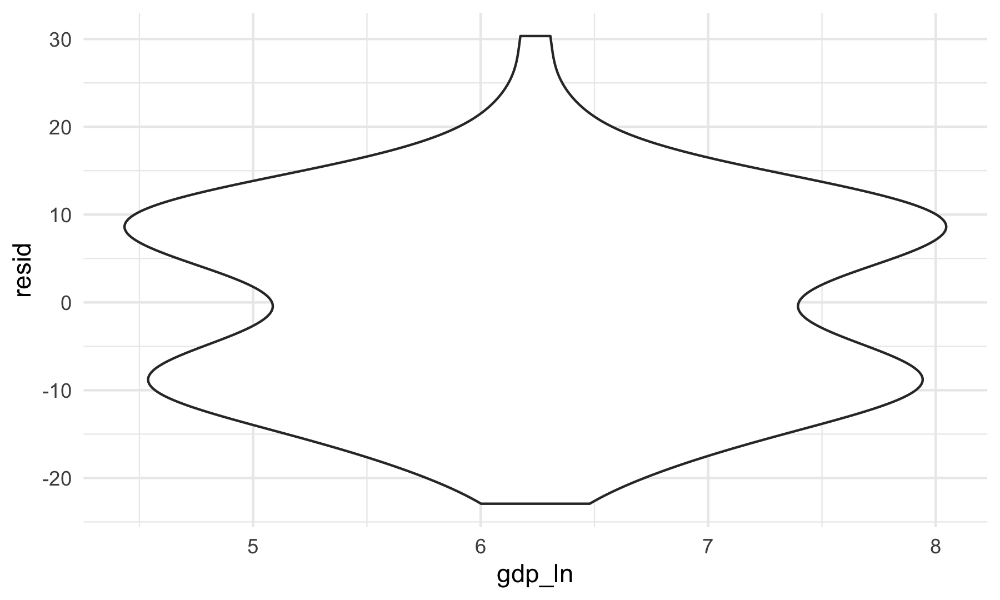

Regression Analysis
================
Lin Yang
11/20/2021

## Create a data frame for regression analysis

Load and clean air quality datasets for 100 cities.

``` r
city_100_df = tibble(
  file = list.files("100_cities_data")) %>% 
  mutate(
    city = str_remove(file, "-air-quality.csv"),
    path = str_c("100_cities_data/", file),
    data = map(path, read_csv)
  ) %>% 
  unnest(data) %>% 
  select(-file, -path) %>% 
  mutate(
    city = str_to_title(city),
    date = as.Date(date, format = "%Y/%m/%d"))
```

Select pm2.5 AQI during the lockdown period (Feb-Apr) for both 2019 and
2020.

``` r
pm25_2020 = 
  city_100_df %>% 
  filter(date > "2020-01-31" & date < "2020-05-01") %>% 
  rename(pm25_2020 = pm25) %>% 
  mutate(date = format(date, format = "%m-%d")) %>% 
  select(city, date, pm25_2020)
  
pm25_2019 = 
  city_100_df %>% 
  filter(date > "2019-01-31" & date < "2019-05-01") %>% 
  rename(pm25_2019 = pm25) %>% 
  mutate(date = format(date, format = "%m-%d")) %>% 
  select(city, date, pm25_2019)
```

Calculate daily pm2.5 AQI differences between 2019 and 2020 for each
city.

``` r
pm25_diff = 
  left_join(pm25_2020, pm25_2019, by = c("city", "date")) %>% 
  drop_na() %>% 
  mutate(pm25_diff = pm25_2019 - pm25_2020) %>% 
  group_by(city) %>% 
  summarize(mean_diff = mean(pm25_diff, na.rm = T))

pm25_diff
```

    ## # A tibble: 100 × 2
    ##    city      mean_diff
    ##    <chr>         <dbl>
    ##  1 Anyang        45.5 
    ##  2 Baoding       28.4 
    ##  3 Baotou         6.53
    ##  4 Beijing       16.0 
    ##  5 Cangzhou      23.3 
    ##  6 Changchun      1.18
    ##  7 Changde        1.61
    ##  8 Changsha       4.03
    ##  9 Changzhou     27.1 
    ## 10 Chengdu       10.5 
    ## # … with 90 more rows

Load the gdp and population dataset and join it to `pm25_diff`.

``` r
gdp_pop_df = 
  read_csv("data/gpd_and_popluation.csv") %>% 
  janitor::clean_names() %>% 
  mutate(pop_ln = log(population_thousand, base = exp(1)),
         gdp_ln = log(gdp_billion, base = exp(1))) %>% 
  select(city, gdp_ln, pop_ln)

diff_gdp_pop_df = left_join(pm25_diff, gdp_pop_df) 
diff_gdp_pop_df
```

    ## # A tibble: 100 × 4
    ##    city      mean_diff gdp_ln pop_ln
    ##    <chr>         <dbl>  <dbl>  <dbl>
    ##  1 Anyang        45.5    5.65   8.55
    ##  2 Baoding       28.4    5.96   9.37
    ##  3 Baotou         6.53   5.69   7.97
    ##  4 Beijing       16.0    8.17   9.99
    ##  5 Cangzhou      23.3    5.88   8.93
    ##  6 Changchun      1.18   6.38   8.99
    ##  7 Changde        1.61   5.89   8.67
    ##  8 Changsha       4.03   7.14   9.01
    ##  9 Changzhou     27.1    6.61   8.56
    ## 10 Chengdu       10.5    7.44   9.70
    ## # … with 90 more rows

We learned that air quality improvement in a city may correlates to the
city’s GDP and population, so we created a data frame containing mean
pm2.5 AQI differences between 2019 and 2020, GDP and population in 2019
for 100 representative cities. The resulting data frame of
`diff_gdp_pop_df` contains 100 observations of 4 variables. Each row
represents one unique city. Below are key variables: `city`: city name
`mean_diff` mean pm2.5 AQI difference during the lockdown period
(Feb-Apr) between 2019 and 2020. `gdp_ln`: log of 2019 GDP in billions
`pop_ln`: log of 2019 population in thousands

## Fit linear models

``` r
fit = lm(mean_diff ~gdp_ln + pop_ln, data = diff_gdp_pop_df)
summary(fit)
```

    ## 
    ## Call:
    ## lm(formula = mean_diff ~ gdp_ln + pop_ln, data = diff_gdp_pop_df)
    ## 
    ## Residuals:
    ##      Min       1Q   Median       3Q      Max 
    ## -22.9298  -9.3085  -0.2823   9.0568  30.3316 
    ## 
    ## Coefficients:
    ##             Estimate Std. Error t value Pr(>|t|)
    ## (Intercept)  -4.6251    19.5716  -0.236    0.814
    ## gdp_ln       -0.8938     2.3591  -0.379    0.706
    ## pop_ln        2.9034     3.0895   0.940    0.350
    ## 
    ## Residual standard error: 11.16 on 94 degrees of freedom
    ##   (3 observations deleted due to missingness)
    ## Multiple R-squared:  0.0111, Adjusted R-squared:  -0.009941 
    ## F-statistic: 0.5275 on 2 and 94 DF,  p-value: 0.5918

``` r
fit %>% 
  broom::tidy() %>% 
  select(term, estimate, p.value) %>% 
  knitr::kable(digit = 3)
```

| term        | estimate | p.value |
|:------------|---------:|--------:|
| (Intercept) |   -4.625 |   0.814 |
| gdp\_ln     |   -0.894 |   0.706 |
| pop\_ln     |    2.903 |   0.350 |

After fitting a linear model for mean pm2.5 AQI difference dependent on
gdp\_ln and pop\_ln, gdp\_ln variable has a slope of -0.894 and pop\_ln
variable has a slope of 2.903. However, p values of the two linear
models are both very large. Therefore, we don’t have enough evidence to
support that air quality improvement has a linear relation with GDP and
population.

## Model Diagnostics

``` r
diff_gdp_pop_df %>% 
  modelr::add_residuals(fit) %>% 
  ggplot(aes(x = gdp_ln, y = resid)) + geom_violin()
```



``` r
diff_gdp_pop_df %>% 
  modelr::add_residuals(fit) %>% 
  ggplot(aes(x = pop_ln, y = resid)) + geom_violin()
```


## Cross Validation

Fit three models for `mean_diff` vs. `gdp_ln`.

``` r
linear_mod_gdp = lm(mean_diff ~ gdp_ln, data = diff_gdp_pop_df)
smooth_mod_gdp = gam(mean_diff ~ s(gdp_ln), data = diff_gdp_pop_df)
wiggly_mod_gdp = gam(mean_diff ~ s(gdp_ln, k = 30), sp = 10e-6, data = diff_gdp_pop_df)
diff_gdp_pop_df %>% 
  gather_predictions(linear_mod_gdp, smooth_mod_gdp, wiggly_mod_gdp) %>% 
  mutate(model = fct_inorder(model)) %>% 
  ggplot(aes(x = gdp_ln, y = mean_diff)) + 
  geom_point(alpha = .5) +
  geom_line(aes(y = pred), color = "red") + 
  facet_grid(~model) +
  labs(
    x = "log(GDP in Billion)",
    y = "Mean Daily PM2.5 AQI Difference")
```


Fit three models for `mean_diff` vs. `pop_ln`.

``` r
linear_mod_pop = lm(mean_diff ~ pop_ln, data = diff_gdp_pop_df)
smooth_mod_pop = gam(mean_diff ~ s(pop_ln), data = diff_gdp_pop_df)
wiggly_mod_pop = gam(mean_diff ~ s(pop_ln, k = 30), sp = 10e-6, data = diff_gdp_pop_df)
diff_gdp_pop_df %>% 
  gather_predictions(linear_mod_pop, smooth_mod_pop, wiggly_mod_pop) %>% 
  mutate(model = fct_inorder(model)) %>% 
  ggplot(aes(x = pop_ln, y = mean_diff)) + 
  geom_point(alpha = .5) +
  geom_line(aes(y = pred), color = "red") + 
  facet_grid(~model) +
  labs(
    x = "log(Population in Thousand)",
    y = "Mean Daily PM2.5 AQI Difference")
```


Cross validation for `mean_diff` vs. `gdp_ln`.

``` r
cv_df_gdp = 
  crossv_mc(diff_gdp_pop_df, 100) %>% 
  mutate(
    train = map(train, as_tibble),
    test = map(test, as_tibble)) %>% 
  mutate(
    linear_mod  = map(train, ~lm(mean_diff ~ gdp_ln, data = .x)),
    smooth_mod  = map(train, ~mgcv::gam(mean_diff ~ s(gdp_ln), data = .x)),
    wiggly_mod  = map(train, ~gam(mean_diff ~ s(gdp_ln, k = 30), sp = 10e-6, data = .x))) %>% 
  mutate(
    rmse_linear = map2_dbl(linear_mod, test, ~rmse(model = .x, data = .y)),
    rmse_smooth = map2_dbl(smooth_mod, test, ~rmse(model = .x, data = .y)),
    rmse_wiggly = map2_dbl(wiggly_mod, test, ~rmse(model = .x, data = .y))) %>% 
  select(starts_with("rmse")) %>%
  pivot_longer(
    everything(),
    names_to = "model", 
    values_to = "rmse",
    names_prefix = "rmse_") 

cv_df_gdp %>% 
  mutate(model = fct_inorder(model)) %>% 
  ggplot(aes(x = model, y = rmse)) + 
  geom_violin(aes(fill = model), alpha = 0.5) +
  labs(title = "RMSE vs. Model")
```


Cross validation for `mean_diff` vs. `pop_ln`.

``` r
cv_df_pop = 
  crossv_mc(diff_gdp_pop_df, 100) %>% 
  mutate(
    train = map(train, as_tibble),
    test = map(test, as_tibble)) %>% 
  mutate(
    linear_mod  = map(train, ~lm(mean_diff ~ pop_ln, data = .x)),
    smooth_mod  = map(train, ~mgcv::gam(mean_diff ~ s(pop_ln), data = .x)),
    wiggly_mod  = map(train, ~gam(mean_diff ~ s(pop_ln, k = 30), sp = 10e-6, data = .x))) %>% 
  mutate(
    rmse_linear = map2_dbl(linear_mod, test, ~rmse(model = .x, data = .y)),
    rmse_smooth = map2_dbl(smooth_mod, test, ~rmse(model = .x, data = .y)),
    rmse_wiggly = map2_dbl(wiggly_mod, test, ~rmse(model = .x, data = .y))) %>% 
  select(starts_with("rmse")) %>%
  pivot_longer(
    everything(),
    names_to = "model", 
    values_to = "rmse",
    names_prefix = "rmse_")

cv_df_pop %>% 
  mutate(model = fct_inorder(model)) %>% 
  ggplot(aes(x = model, y = rmse)) + 
  geom_violin(aes(fill = model), alpha = 0.5) +
  labs(title = "RMSE vs. Model")
```


We then did cross validation for three different kinds of models of mean
PM2.5 difference vs. gdp\_ln and pop\_ln. The scatterplots indicated
that none of the three models were good fits. For both gdp\_ln and
pop\_ln, the distribution of RMSE values for each model suggested that
linear and smooth models worked better than wiggly model. But the RMSE
values of all the three models were significantly large, confirming all
of them were bad fits.

## Create a data frame containing weather data for regression analysis

Load weather data for 10 representative cities.

``` r
weather_df = 
  rnoaa::meteo_pull_monitors(
    c("CHM00054511", "CHM00058362", "CHM00050953", "CHM00054342", "CHM00055591", "CHM00056294", "CHM00056778", "CHM00059287", "CHM00057036", "CHM00057494"),
    var = c("PRCP", "TAVG"), 
    date_min = "2020-02-01",
    date_max = "2020-04-30") %>%
  mutate(
    name = recode(
      id, 
      CHM00054511 = "Beijing", 
      CHM00058362 = "Shanghai",
      CHM00050953 = "Harbin",
      CHM00054342 = "Shenyang",
      CHM00055591 = "Lasa",
      CHM00056294 = "Chengdu",
      CHM00056778 = "Kunming",
      CHM00059287 = "Guangzhou",
      CHM00057036 = "Xian",
      CHM00057494 = "Wuhan"),
    tavg = tavg / 10,
    prcp = prcp / 10) %>%
  select(-id) %>% 
  rename(city = name) %>% 
  relocate(city)

weather_df
```

    ## # A tibble: 900 × 4
    ##    city    date        prcp  tavg
    ##    <chr>   <date>     <dbl> <dbl>
    ##  1 Beijing 2020-02-01   1     1.6
    ##  2 Beijing 2020-02-02   0.3  -2.8
    ##  3 Beijing 2020-02-03   0    -2.6
    ##  4 Beijing 2020-02-04   0    -4.1
    ##  5 Beijing 2020-02-05   2.8  -6  
    ##  6 Beijing 2020-02-06   1.3  -6.1
    ##  7 Beijing 2020-02-07   0    -4.4
    ##  8 Beijing 2020-02-08   0    -0.6
    ##  9 Beijing 2020-02-09   0    -0.5
    ## 10 Beijing 2020-02-10   0     1.8
    ## # … with 890 more rows

Join `weather_df` to the AQI dataset of 10 cities.

``` r
city_10_df =
  city_100_df %>% 
  filter(date > "2020-01-31" & date < "2020-05-01") %>% 
  filter(city %in% c("Beijing", "Shanghai", "Harbin", "Shenyang", "Lasa", "Chengdu", "Kunming", "Guangzhou", "Xian", "Wuhan"))

pm25_tavg_df = 
  left_join(city_10_df, weather_df, by = c("city", "date")) %>% 
  arrange(date) %>% 
  select(city, date, pm25, tavg) %>% 
  drop_na() 

pm25_tavg_df
```

    ## # A tibble: 794 × 4
    ##    city      date        pm25  tavg
    ##    <chr>     <date>     <dbl> <dbl>
    ##  1 Beijing   2020-02-01   120   1.6
    ##  2 Chengdu   2020-02-01   120   8.8
    ##  3 Guangzhou 2020-02-01    84  15.6
    ##  4 Harbin    2020-02-01   240 -14.9
    ##  5 Kunming   2020-02-01    75   9.3
    ##  6 Shanghai  2020-02-01   126   4.9
    ##  7 Shenyang  2020-02-01   257  -9.4
    ##  8 Wuhan     2020-02-01   168  10  
    ##  9 Xian      2020-02-01   197   5.3
    ## 10 Beijing   2020-02-02    30  -2.8
    ## # … with 784 more rows

``` r
pm25_tavg_df %>% 
  ggplot(aes(x = tavg, y = pm25)) +
  geom_point() +
  labs(
    x = "Daily Average Temperature",
    y = "Daily PM 2.5 AQI",
    title = "Daily PM 2.5 AQI VS. Daily Average Temperature Feb-Apr in 2020"
  )
```


Fit a linear model.

``` r
fit2 = lm(pm25 ~tavg, data = pm25_tavg_df)
summary(fit2)
```

    ## 
    ## Call:
    ## lm(formula = pm25 ~ tavg, data = pm25_tavg_df)
    ## 
    ## Residuals:
    ##    Min     1Q Median     3Q    Max 
    ## -95.51 -31.45  -3.12  26.22 480.43 
    ## 
    ## Coefficients:
    ##             Estimate Std. Error t value Pr(>|t|)    
    ## (Intercept) 113.7598     2.6676  42.645   <2e-16 ***
    ## tavg         -0.4239     0.1963  -2.159   0.0311 *  
    ## ---
    ## Signif. codes:  0 '***' 0.001 '**' 0.01 '*' 0.05 '.' 0.1 ' ' 1
    ## 
    ## Residual standard error: 47.51 on 792 degrees of freedom
    ## Multiple R-squared:  0.005853,   Adjusted R-squared:  0.004598 
    ## F-statistic: 4.663 on 1 and 792 DF,  p-value: 0.03112
