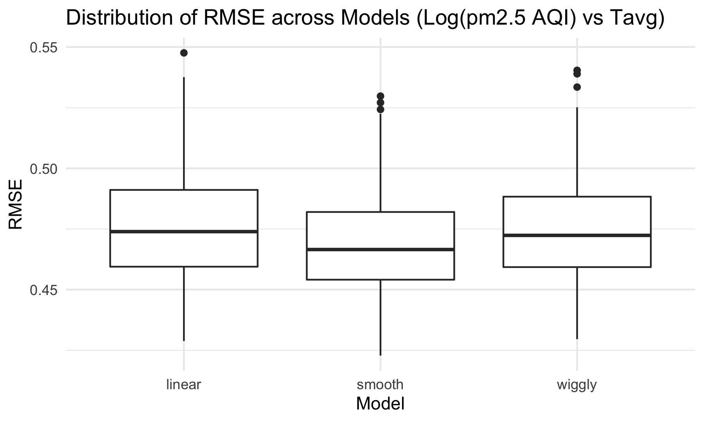

Regression Analysis
================
Lin Yang
11/20/2021

## Create a data frame for regression analysis

Load and clean air quality datasets for 100 cities.

``` r
city_100_df = 
  tibble(
  file = list.files("100_cities_data")) %>% 
  mutate(
    city = str_remove(file, "-air-quality.csv"),
    path = str_c("100_cities_data/", file),
    data = map(path, read_csv)
  ) %>% 
  unnest(data) %>% 
  select(-file, -path) %>% 
  mutate(
    city = str_to_title(city),
    date = as.Date(date, format = "%Y/%m/%d"))
```

Select pm2.5 AQI during the lockdown period (Feb-Apr) and calculated
mean pm2.5 AQI for both 2019 and 2020. Combine two data sets to get mean
AQI differences between 2019 and 2020 for 100 cities.

``` r
pm25_2020 = 
  city_100_df %>% 
  filter(date > "2020-01-31" & date < "2020-05-01") %>% 
  group_by(city) %>%
  summarize(mean_pm25_2020 = mean(pm25, na.rm = T))
  
pm25_2019 = 
  city_100_df %>% 
  filter(date > "2019-01-31" & date < "2019-05-01") %>% 
  group_by(city) %>%
  summarize(mean_pm25_2019 = mean(pm25, na.rm = T))

pm25_diff = 
  left_join(pm25_2020, pm25_2019) %>% 
  mutate(pm25_diff = mean_pm25_2019 - mean_pm25_2020)

pm25_diff
```

    ## # A tibble: 100 × 4
    ##    city      mean_pm25_2020 mean_pm25_2019 pm25_diff
    ##    <chr>              <dbl>          <dbl>     <dbl>
    ##  1 Anyang             135.            179.    44.0  
    ##  2 Baoding            125.            151.    26.1  
    ##  3 Baotou             123.            128.     4.78 
    ##  4 Beijing            101.            117.    15.6  
    ##  5 Cangzhou           113.            134.    21.6  
    ##  6 Changchun          130.            131.     0.970
    ##  7 Changde            114.            116.     2.06 
    ##  8 Changsha           120.            125.     4.98 
    ##  9 Changzhou           97.0           124.    26.6  
    ## 10 Chengdu            120.            130.    10.4  
    ## # … with 90 more rows

Load the gdp and population dataset and join it to `pm25_diff`.

``` r
gdp_pop_df = 
  read_csv("data/gpd_and_popluation.csv") %>% 
  janitor::clean_names() %>% 
  mutate(
    gdp_trillion = gdp_billion / 1000,
    pop_million = population_thousand / 1000) %>% 
  select(city, gdp_trillion, pop_million)

diff_gdp_pop_df = 
  left_join(pm25_diff, gdp_pop_df) %>% 
  select(-mean_pm25_2020, -mean_pm25_2019)
diff_gdp_pop_df
```

    ## # A tibble: 100 × 4
    ##    city      pm25_diff gdp_trillion pop_million
    ##    <chr>         <dbl>        <dbl>       <dbl>
    ##  1 Anyang       44.0          0.284        5.17
    ##  2 Baoding      26.1          0.388       11.7 
    ##  3 Baotou        4.78         0.296        2.89
    ##  4 Beijing      15.6          3.54        21.7 
    ##  5 Cangzhou     21.6          0.359        7.59
    ##  6 Changchun     0.970        0.590        8   
    ##  7 Changde       2.06         0.362        5.83
    ##  8 Changsha      4.98         1.26         8.16
    ##  9 Changzhou    26.6          0.74         5.2 
    ## 10 Chengdu      10.4          1.70        16.3 
    ## # … with 90 more rows

We learned that air quality improvements in a city may correlate to the
city’s GDP and population, so we created a data frame containing mean
pm2.5 AQI differences between 2019 and 2020, GDP and population in 2019
for 100 representative cities. The resulting data frame of
`diff_gdp_pop_df` contains 100 observations of 4 variables. Each row
represents one unique city. Below are key variables: `city`: city name
`pm25_diff` difference of mean pm2.5 AQI during the lockdown period
(Feb-Apr) between 2019 and 2020 `gdp_trillion`: 2019 GDP in trillion
`pop_million`: 2019 population in thousand

## Box-Cox Transformation

Since the boxcox function only works with positive values for the
response variable y, we removed pm25\_diff less than 0 to check if a
transformation is appropriate here.

``` r
pos_diff_gdp_pop_df =
  diff_gdp_pop_df %>% 
  filter(pm25_diff > 0)
  
fit = lm(pm25_diff ~gdp_trillion + pop_million, data = pos_diff_gdp_pop_df)
MASS::boxcox(fit)
```


The box-cox plot shows that log-likelihood has the maximum value around
lambda = 0.5, so square root of pm25\_diff is the recommended
transformation.

``` r
trans_diff_gdp_pop_df =
  pos_diff_gdp_pop_df %>% 
  mutate(sqrt_pm25_diff = sqrt(pm25_diff))

trans_fit = lm(sqrt_pm25_diff ~gdp_trillion + pop_million, data = trans_diff_gdp_pop_df)

trans_fit %>% 
  broom::tidy() %>% 
  knitr::kable(caption = "Linear Regression Results")
```

| term          |   estimate | std.error |  statistic |   p.value |
|:--------------|-----------:|----------:|-----------:|----------:|
| (Intercept)   |  3.7187826 | 0.2799728 | 13.2826555 | 0.0000000 |
| gdp\_trillion |  0.0436444 | 0.3796025 |  0.1149740 | 0.9087190 |
| pop\_million  | -0.0102924 | 0.0529619 | -0.1943355 | 0.8463464 |

Linear Regression Results

After fitting a linear model for sqrt(mean pm2.5 AQI difference)
dependent on gdp\_trillion and pop\_million, gdp\_trillion variable has
a slope of 0.0436 and pop\_million variable has a slope of -0.0103 with
p values of 0.909 and 0.846 which are extremely large. Therefore, GDP
and population in a city don’t have significant effects on predictions
of air quality improvement, in other words, we don’t have enough
evidence to support that air quality improvement has a linear
relationship with GDP and population.

## Model Diagnostics

``` r
gdp_resid =
  trans_diff_gdp_pop_df %>% 
  add_residuals(trans_fit) %>% 
  ggplot(aes(x = gdp_trillion, y = resid)) + geom_violin()

pop_resid = 
  trans_diff_gdp_pop_df %>% 
  add_residuals(trans_fit) %>% 
  ggplot(aes(x = pop_million, y = resid)) + geom_violin()

gdp_resid + pop_resid
```


``` r
trans_diff_gdp_pop_df %>% 
  add_residuals(trans_fit) %>% 
  add_predictions(trans_fit) %>% 
  ggplot(aes(x = pred, y = resid)) +
  geom_point(alpha = 0.2) +
  geom_smooth(color = "red", method = "lm", se = FALSE)
```


``` r
par(mfrow = c(2,2))
plot(trans_fit)
```


## Cross Validation

Fit three models for `sqrt_pm25_diff` vs. `gdp_trillion` and
`pop_million`.

``` r
linear_mod = lm(sqrt_pm25_diff ~ gdp_trillion + pop_million, data = trans_diff_gdp_pop_df)
smooth_mod = gam(sqrt_pm25_diff ~ s(gdp_trillion, pop_million), data = trans_diff_gdp_pop_df)
wiggly_mod = gam(sqrt_pm25_diff ~ s(gdp_trillion, pop_million, k = 30), sp = 10e-6, data = trans_diff_gdp_pop_df)
trans_diff_gdp_pop_df %>% 
  gather_predictions(linear_mod, smooth_mod, wiggly_mod) %>% 
  mutate(model = fct_inorder(model)) %>% 
  ggplot(aes(x = gdp_trillion + pop_million, y = sqrt_pm25_diff)) + 
  geom_point(alpha = .5) +
  geom_line(aes(y = pred), color = "red") + 
  facet_grid(~model) +
  labs(
    x = "GDP in Billion + Population in Million",
    y = "Sqrt(Mean PM2.5 AQI Difference)",
    title = "Sqrt(Mean PM2.5 AQI Difference) vs GDP and Population")
```


Cross validation for `mean_diff` vs. `gdp_trillion` and `pop_million`.

``` r
cv_df = 
  crossv_mc(trans_diff_gdp_pop_df, 100) %>% 
  mutate(
    train = map(train, as_tibble),
    test = map(test, as_tibble)) %>% 
  mutate(
    linear_mod  = map(train, ~lm(sqrt_pm25_diff ~ gdp_trillion + pop_million, data = .x)),
    smooth_mod  = map(train, ~mgcv::gam(sqrt_pm25_diff ~ s(gdp_trillion, pop_million), data = .x)),
    wiggly_mod  = map(train, ~gam(sqrt_pm25_diff ~ s(gdp_trillion, pop_million, k = 30), sp = 10e-6, data = .x))) %>% 
  mutate(
    rmse_linear = map2_dbl(linear_mod, test, ~rmse(model = .x, data = .y)),
    rmse_smooth = map2_dbl(smooth_mod, test, ~rmse(model = .x, data = .y)),
    rmse_wiggly = map2_dbl(wiggly_mod, test, ~rmse(model = .x, data = .y))) 


cv_df %>%
  select(starts_with("rmse")) %>%
  pivot_longer(
    everything(),
    names_to = "model", 
    values_to = "rmse",
    names_prefix = "rmse_") %>% 
  mutate(model = fct_inorder(model)) %>% 
  ggplot(aes(x = model, y = rmse)) + 
  geom_boxplot() +
  labs(
    x = "Model",
    y = "RMSE",
    title = "Distribution of RMSE across Models (Log(Mean PM2.5 AQI Difference) vs GDP +Population)") +
  theme(
    title = element_text(size = 6, face = "bold"),
    axis.title.x = element_text(size = 10),
    axis.title.y = element_text(size = 10))
```


We then did cross validation for three different kinds of models of mean
PM2.5 AQI difference vs. gdp\_trillion and pop\_million. The
scatterplots indicated that none of the three models fitted well. The
distribution of RMSE values for each model suggested that linear and
smooth models worked slightly better than wiggly model. But the RMSE
values of all the three models were significantly large, confirming them
were all bad fits.

## Create a data frame containing weather data for regression analysis

Load weather data for 10 representative cities.

``` r
weather_df = 
  rnoaa::meteo_pull_monitors(
    c("CHM00054511", "CHM00058362", "CHM00050953", "CHM00054342", "CHM00055591", "CHM00056294", "CHM00056778", "CHM00059287", "CHM00057036", "CHM00057494"),
    var = c("PRCP", "TAVG"), 
    date_min = "2020-02-01",
    date_max = "2020-04-30") %>%
  mutate(
    name = recode(
      id, 
      CHM00054511 = "Beijing", 
      CHM00058362 = "Shanghai",
      CHM00050953 = "Harbin",
      CHM00054342 = "Shenyang",
      CHM00055591 = "Lhasa",
      CHM00056294 = "Chengdu",
      CHM00056778 = "Kunming",
      CHM00059287 = "Guangzhou",
      CHM00057036 = "Xian",
      CHM00057494 = "Wuhan"),
    tavg = tavg / 10,
    prcp = prcp / 10) %>%
  select(-id) %>% 
  rename(city = name) %>% 
  relocate(city)

weather_df
```

    ## # A tibble: 900 × 4
    ##    city    date        prcp  tavg
    ##    <chr>   <date>     <dbl> <dbl>
    ##  1 Beijing 2020-02-01   1     1.6
    ##  2 Beijing 2020-02-02   0.3  -2.8
    ##  3 Beijing 2020-02-03   0    -2.6
    ##  4 Beijing 2020-02-04   0    -4.1
    ##  5 Beijing 2020-02-05   2.8  -6  
    ##  6 Beijing 2020-02-06   1.3  -6.1
    ##  7 Beijing 2020-02-07   0    -4.4
    ##  8 Beijing 2020-02-08   0    -0.6
    ##  9 Beijing 2020-02-09   0    -0.5
    ## 10 Beijing 2020-02-10   0     1.8
    ## # … with 890 more rows

Join `weather_df` to the AQI dataset of 10 cities.

``` r
city_10_df =
  city_100_df %>% 
  filter(date > "2020-01-31" & date < "2020-05-01") %>% 
  filter(city %in% c("Beijing", "Shanghai", "Harbin", "Shenyang", "Lhasa", "Chengdu", "Kunming", "Guangzhou", "Xian", "Wuhan"))

pm25_tavg_df = 
  left_join(city_10_df, weather_df, by = c("city", "date")) %>% 
  arrange(date) %>% 
  select(city, date, pm25, tavg) %>% 
  filter(pm25 != "NA")
```

## Find appropriate transformation

``` r
fit_tavg = lm(pm25 ~tavg, data = pm25_tavg_df)
MASS::boxcox(fit_tavg)
```


``` r
log_pm25_tavg_df =
  pm25_tavg_df %>% 
  mutate(lnpm25 = log(pm25))

log_fit = lm(lnpm25 ~tavg, data = log_pm25_tavg_df)
log_fit %>%
  broom::tidy() %>% 
  knitr::kable(caption = "Linear Regression Results")
```

| term        |  estimate | std.error |  statistic |   p.value |
|:------------|----------:|----------:|-----------:|----------:|
| (Intercept) | 4.5007147 | 0.0250049 | 179.993116 | 0.0000000 |
| tavg        | 0.0028357 | 0.0019151 |   1.480744 | 0.1390328 |

Linear Regression Results

Model diagnostics

``` r
log_pm25_tavg_df %>% 
  add_residuals(log_fit) %>% 
  add_predictions(log_fit) %>% 
  ggplot(aes(x = pred, y = resid)) +
  geom_point(alpha = 0.2) +
  geom_smooth(method = "lm", color = "red", se = FALSE)
```


Residuals appear to be evenly distributed around 0, which is an
indication of constant variance.

``` r
par(mfrow = c(2,2))
plot(log_fit)
```



## Cross validation

Fit three models

``` r
linear_mod_tavg = lm(lnpm25 ~ tavg, data = log_pm25_tavg_df)
smooth_mod_tavg = gam(lnpm25 ~ s(tavg), data = log_pm25_tavg_df)
wiggly_mod_tavg = gam(lnpm25 ~ s(tavg, k = 30), sp = 10e-6, data = log_pm25_tavg_df)

log_pm25_tavg_df %>% 
  gather_predictions(linear_mod_tavg, smooth_mod_tavg, wiggly_mod_tavg) %>% 
  mutate(model = fct_inorder(model)) %>% 
  ggplot(aes(x = tavg, y = lnpm25)) + 
  geom_point(alpha = .5) +
  geom_line(aes(y = pred), color = "red") + 
  facet_grid(~model)
```


``` r
cv_tavg_df = 
  crossv_mc(log_pm25_tavg_df, 100) %>% 
  mutate(
    train = map(train, as_tibble),
    test = map(test, as_tibble)) %>% 
  mutate(
    linear_mod  = map(train, ~lm(lnpm25 ~ tavg, data = .x)),
    smooth_mod  = map(train, ~mgcv::gam(lnpm25 ~ s(tavg), data = .x)),
    wiggly_mod  = map(train, ~gam(lnpm25 ~ s(tavg, k = 30), sp = 10e-6, data = .x))) %>% 
  mutate(
    rmse_linear = map2_dbl(linear_mod, test, ~rmse(model = .x, data = .y)),
    rmse_smooth = map2_dbl(smooth_mod, test, ~rmse(model = .x, data = .y)),
    rmse_wiggly = map2_dbl(wiggly_mod, test, ~rmse(model = .x, data = .y)))

cv_tavg_df %>% 
  select(starts_with("rmse")) %>% 
  pivot_longer(
    everything(),
    names_to = "model", 
    values_to = "rmse",
    names_prefix = "rmse_") %>% 
  mutate(model = fct_inorder(model)) %>% 
  ggplot(aes(x = model, y = rmse)) + 
  geom_boxplot() +
  labs(
    x = "Model",
    y = "RMSE",
    title = "Distribution of RMSE across Models (Log(pm2.5 AQI) vs Tavg)")
```


